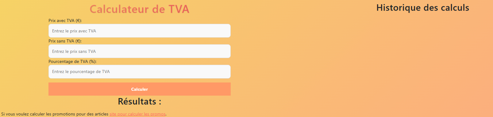

# 🧮 Calculateur de TVA

Ce projet est une application web simple et élégante permettant de calculer le montant HT ou TTC à partir d'un taux de TVA donné. Le design est responsive et agréable, adapté à tous les appareils.

---

## 📸 Aperçu

---

## ✨ Fonctionnalités

-   Calcul du montant **TTC à partir du HT** et **inversement**
-   Interface claire et responsive
-   Design doux avec dégradés et ombres
-   Support du **PWA** (Progressive Web App)
-   Intégration de Bootstrap pour les composants UI

---

## 🧪 Langages & Technologies utilisées

| Langage / Techno | Utilisation                                 |
| ---------------- | ------------------------------------------- |
| HTML5            | Structure de la page                        |
| CSS3             | Mise en page personnalisée (`style.css`)    |
| Bootstrap 5      | Framework CSS pour un design responsive     |
| JavaScript       | Calculs, interactions et scripts dynamiques |
| jQuery           | Simplification du DOM et gestion des events |
| Service Worker   | Fonctionnalité hors ligne (PWA)             |
| JSON             | Manifest pour la Progressive Web App        |

---

## 🖌️ Couleurs utilisées

Voici la palette de couleurs utilisée pour le style :

| Couleur             | Code hexadécimal      | Utilisation                    |
| ------------------- | --------------------- | ------------------------------ |
| Dégradé orange/rose | `#f6d365` → `#fda085` | Fond principal en dégradé      |
| Brun foncé          | `#5c3d2e`             | Titres (`<h1>`, `<h2>`)        |
| Orange vif          | `#f9a825`             | Bouton principal               |
| Orange foncé        | `#f57f17`             | Hover du bouton                |
| Fond input          | `#fff7f1`             | Fond des champs de saisie      |
| Texte sombre        | `#333`                | Texte standard dans les inputs |

---

## 📁 Structure du projet

assets/
├── css/
│ ├── bootstrap.min.css
│ └── style.css ← fichier principal de style
├── img/
│ └── favicon.png
├── js/
│ ├── bootstrap.min.js
│ ├── instal.js
│ ├── jquery-3.6.1.min.js
│ └── script.js ← logique de calcul TVA
index.html ← page principale
manifest.json ← manifest pour PWA
sw.js ← service worker

## 🚀 Installation locale

1. Clone le dépôt ou télécharge les fichiers.
2. Ouvre `index.html` dans ton navigateur.
3. Tu peux l’installer comme application via l’option PWA.

---

## 🔧 À venir (suggestions d’amélioration)

-   Choix de la langues
-   Et d'autre a réfléchir

---

## 🐰 Réalisé par

Florie – Développeuse web passionnée, amoureuse des animaux et fan de projets utiles et bien présentés 🧡
